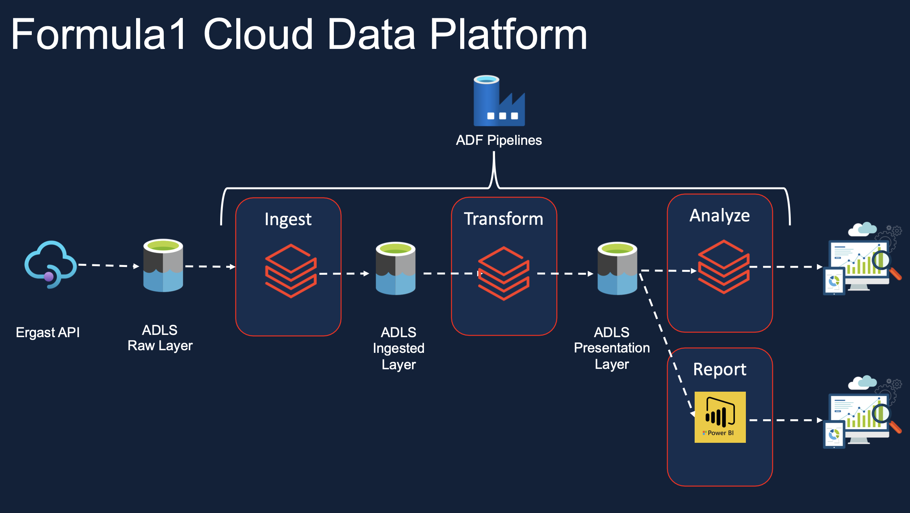

# Azure Databricks for Formula1 Data Engineering Project

## Welcome!
This project is based on in-demand data engineering tools in the cloud, Azure Databricks! 

## Project Goals
### Azure Databricks
- Building a solution architecture for a data engineering solution using Azure Databricks, Azure Data Lake Gen2, Azure Data Factory, and Power BI.
- Creating and using Azure Databricks service and understanding the architecture of Databricks within Azure.
- Working with Databricks notebooks and using Databricks utilities, magic commands, etc.
- Passing parameters between notebooks and creating notebook workflows.
- Creating, configuring, and monitoring Databricks clusters, cluster pools, and jobs.
- Mounting Azure Storage in Databricks using secrets stored in Azure Key Vault.
- Working with Databricks Tables and Databricks File System (DBFS).
- Using Delta Lake to implement a solution using Lakehouse architecture.
- Creating dashboards to visualize outputs.
- Connecting to Azure Databricks tables from PowerBI.

### Spark (Only PySpark and SQL)
- Spark architecture, Data Sources API, and Dataframe API.
- PySpark: Ingesting CSV, simple, and complex JSON files into the data lake as parquet files/tables.
- PySpark: Transformations such as Filter, Join, Simple Aggregations, GroupBy, Window functions, etc.
- PySpark: Creating local and temporary views.
- Spark SQL: Creating databases, tables, and views.
- Spark SQL: Transformations such as Filter, Join, Simple Aggregations, GroupBy, Window functions, etc.
- Spark SQL: Creating local and temporary views.
- Implementing full refresh and incremental load patterns using partitions.

### Delta Lake
- Emergence of Data Lakehouse architecture and the role of Delta Lake.
- Reading, Writing, Updating, Deleting, and Merging to Delta Lake using both PySpark and SQL.
- History and Time Travel.
- Converting Parquet files to Delta files.
- Implementing incremental load patterns using Delta Lake.

### Azure Data Factory
- Creating pipelines to execute Databricks notebooks.
- Designing robust pipelines to deal with unexpected scenarios such as missing files.
- Creating dependencies between activities and pipelines.
- Scheduling the pipelines using Data Factory triggers to execute at regular intervals.
- Monitoring the triggers/pipelines to check for errors/outputs.

## Who This Project Is For
- University students looking for a career in Data Engineering.
- IT developers working in other disciplines who want to move to Data Engineering.
- Data Engineers/Data Warehouse Developers currently working on on-premises technologies or other cloud platforms like AWS or GCP who want to learn Azure Data Technologies.
- Data Architects looking to gain an understanding of the Azure Data Engineering stack.

## Learning Outcomes
By the end of this project, you will:
- Understand how to use Azure Databricks for end-to-end data engineering tasks.
- Gain hands-on experience with data ingestion, transformation, and visualization.
- Learn how to automate and schedule data workflows using ADF.
- Implement security best practices using Azure Key Vault.
- Monitor and manage data pipelines effectively.

## Visuals

### Project Solution

### F1-Entity Relationship Diagram

### Ingestion Pipelines

### Transformation Pipeline

### Pipelines Logic

