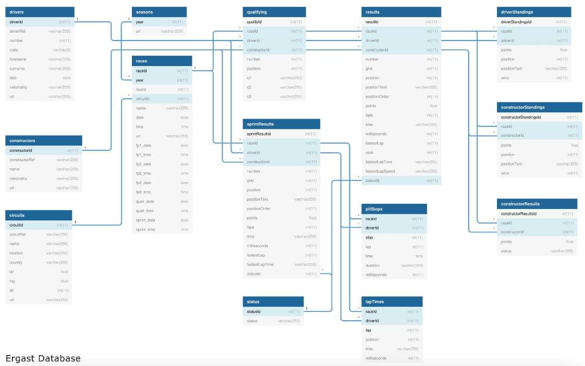
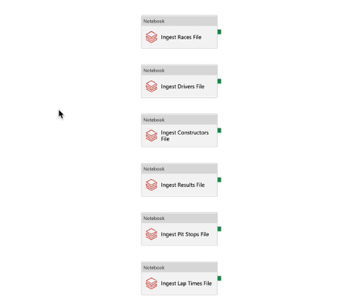
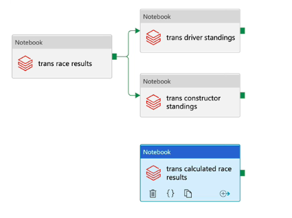
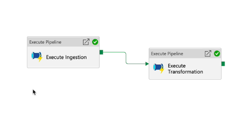

# F1-Project

## Overview

This project aims to provide data engineers with a comprehensive understanding of using Azure Databricks and Spark Core. 
In this project, we will explore and process data related to Formula One motor racing. The objective is to understand the data structure, manipulate different file formats, and gain insights from the data. Formula One, like other major sports leagues, has a structured season with multiple races, teams, drivers, and complex rules.

## Project Goals

1. **Data Ingestion**: Load and explore the various data files.
2. **Data Transformation**: Process and clean the data, handling different file formats.
3. **Data Analysis**: Perform exploratory data analysis to gain insights into the data.
4. **Visualization**: Create visual representations of the data to illustrate key findings.
5. **Documentation**: Document the process, findings, and insights in a structured manner.
6. **Data Engineering Pipelines**: Design and implement end-to-end data engineering pipelines using Azure Databricks to automate data ingestion, processing, and analysis.
7. **Cluster Configuration**: Configure and optimize clusters in Azure Databricks for efficient data processing.
8. **Azure Data Factory**: Utilize Azure Data Factory for orchestrating data workflows and managing data pipelines.
9. **Azure Key Vault**: Implement Azure Key Vault for secure storage and management of secrets, keys, and configurations.
10. **ETL Processes**: Develop Extract, Transform, Load (ETL) processes to ensure data is efficiently and accurately integrated from various sources.
11. **Data Storage**: Utilize appropriate data storage solutions to store processed data for easy access and analysis.
12. **Data Quality and Validation**: Implement data quality checks and validation steps to ensure the integrity and accuracy of the data throughout the pipeline.

## Table of Contents

- [Overview](#overview)
- [What Did I Learn](#what-did-I-learn)
- [Project Structure](#project-structure)
- [Visuals](#visuals)

## Features

- **Comprehensive Learning**: Step-by-step tutorials and practical examples.
- **Data Processing**: Learn how to process large datasets using Spark Core.
- **Azure Integration**: Understand how to integrate Spark with Azure Databricks.
- **Real-World Scenarios**: Apply your knowledge to solve real-world data engineering problems.

## What Did I Learn

- How to build a real-world data project using Azure Databricks and Spark Core with real-world data.
- Acquire professional-level data engineering skills in Azure Databricks, Delta Lake, Spark Core, Azure Data Lake Gen2, and Azure Data Factory (ADF).
- Create notebooks, dashboards, clusters, cluster pools, and jobs in Azure Databricks.
- Ingest and transform data using PySpark in Azure Databricks.
- Transform and analyze data using Spark SQL in Azure Databricks.
- Understand Data Lake architecture and Lakehouse Architecture and implement a Lakehouse architecture using Delta Lake.
- Create Azure Data Factory pipelines to execute Databricks notebooks.
- Create Azure Data Factory triggers to schedule pipelines and monitor them.
- Gain the skills required around Azure Databricks and Data Factory to pass the Azure Data Engineer Associate certification exam DP-203.

## Visuals

### F1-Entity Relationship Diagram

### Ingestion Pipelines

### Transformation Pipeline

### Pipelines Logic

